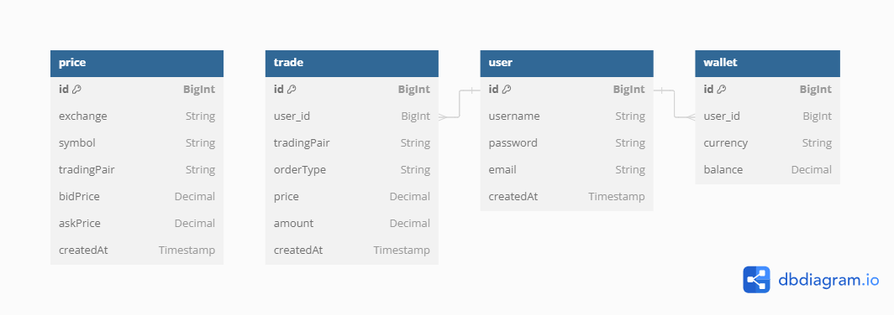

View db diagram at link: https://dbdiagram.io/
```jql
Table price {
id BigInt [pk, increment]
exchange String
symbol String
tradingPair String
bidPrice Decimal
askPrice Decimal
createdAt Timestamp
}

Table trade {
id BigInt [pk, increment]
user_id BigInt [ref: > user.id]
tradingPair String
orderType String
price Decimal
amount Decimal
createdAt Timestamp
}

Table user {
id BigInt [pk, increment]
username String
password String
email String
createdAt Timestamp
}

Table wallet {
id BigInt [pk, increment]
user_id BigInt [ref: > user.id]
currency String
balance Decimal
}

```

